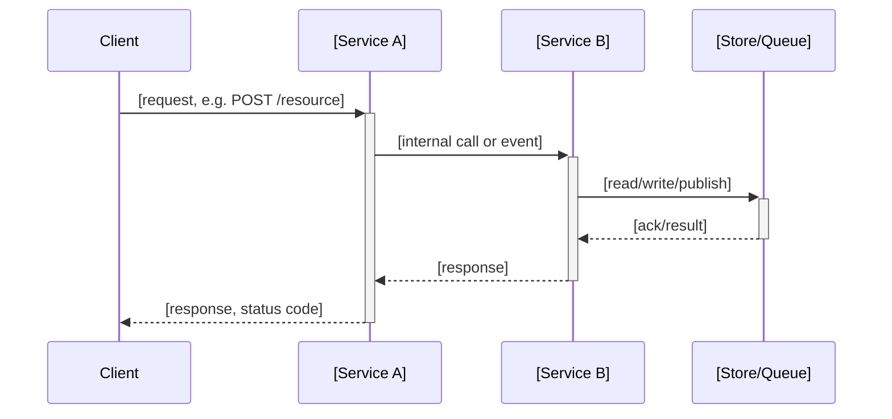

# Brownfield Phase Alignment Implementation Plan

> **For agentic workers:** REQUIRED SUB-SKILL: Use superpowers:subagent-driven-development (recommended) or superpowers:executing-plans to implement this plan task-by-task. Steps use checkbox (`- [ ]`) syntax for tracking.

**Goal:** Add Architecture and Program Design subsections to `design.md`, rewrite the `tasks:` rule for vertical-slice task ordering, and ship three new skills (`system-architecture-doc`, `program-design-doc`, `vertical-slice-planner`) plus three ported research subagents that back them — all via the plugin's existing `rules:`/fragment mechanism, with zero forking of OpenSpec's own schema.

**Architecture:** Two new bundled reference templates (`docs/architecture/TEMPLATE.md`, `docs/program-design/TEMPLATE.md`) plus a shared `research-notes-backend.md` detection doc land first since every downstream skill/fragment reads them. Three ported, environment-agnostic research subagents (`codebase-locator`, `codebase-analyzer`, `codebase-pattern-finder`) land next. Each of the three new skills is then built TDD-style (RED baseline-failures.md → GREEN SKILL.md), matching this repo's established pattern from `schema-config`. Fragment catalog, `config-best-practices.md`, `schema-config`/`setup`/`audit` SKILL.md orchestration, README, and `plugin.json` versioning land last, since they all reference the artifacts built earlier.

**Tech Stack:** Markdown (SKILL.md, references, agents), Claude Code skills/subagents runtime, YAML (`config.yaml` rule blocks), Mermaid (sequence diagrams), Bash (`grep`, `python3 -c "import yaml"` for structural checks — this repo has no live `openspec/` project of its own, so verification is content-structure checking, not `openspec validate`).

## Global Constraints

- Spec: `docs/superpowers/specs/2026-08-17-brownfield-phase-alignment-design.md` — this plan implements it in full; do not deviate from its `## Does NOT` / `## Explicitly Out of Scope` boundaries.
- SDO rule: every new `description:` frontmatter field contains ONLY trigger conditions and "Do NOT use for" exclusions — never a workflow summary.
- Repo root: `/Users/poutrin/projects/github/jpoutrin/openspec-setup-plugin`
- Commit format: conventional commits (`feat(scope): ...`, `test(scope): ...`, `docs: ...`, `chore: ...`)
- All work happens directly on `main` (no feature branches) — matches this repo's own established convention (see prior `schema-config`/`opsx-clarify` plans).
- TDD for skills in this repo: RED (`tests/baseline-failures.md` documenting failure modes) committed first, then GREEN (the skill content that prevents every listed failure) committed second, verified by grepping `(Prevents Failure N)` annotations against the RED count.
- Deviation from the design spec's literal path: the spec's §4 file layout names `.agents/` for the three ported subagents. This repo's actual convention (see commit `7f174e0 refactor: move openspec-expert to agents/`) is `agents/` (no dot); `.agents/openspec-expert.md` is a leftover mirror kept byte-identical to `agents/openspec-expert.md`. This plan follows the established pattern: **write to `agents/`, mirror to `.agents/`**, matching the existing duplication rather than the spec's literal path.
- No `~/.claude/skills/` global-copy step: earlier plans (`schema-config`) included manual `cp` steps to `~/.claude/skills/<name>/`. On this machine no such global copies currently exist for this plugin (confirmed: `~/.claude/skills/schema-config` does not exist) — this plugin is distributed via `claude plugin install` from the marketplace manifest, not manual copying. This plan does not reintroduce manual global installs.
- Push command (only in the final task, and only after explicit confirmation at execution time): `unset GITHUB_TOKEN && unset GH_TOKEN && git push origin main`

---

## File Structure

```
skills/
  setup/
    references/
      architecture-template.md       ← CREATE (Task 1)
      program-design-template.md     ← CREATE (Task 1)
      research-notes-backend.md      ← CREATE (Task 3)
      config-best-practices.md       ← EDIT (Task 11)
    SKILL.md                          ← EDIT (Task 13)
  schema-config/
    references/
      fragments.md                   ← EDIT (Task 10)
    tests/
      baseline-failures.md           ← EDIT (Task 12)
    SKILL.md                          ← EDIT (Task 12)
  audit/
    SKILL.md                          ← EDIT (Task 14)
  system-architecture-doc/
    SKILL.md                          ← CREATE (Task 5)
    tests/
      baseline-failures.md           ← CREATE (Task 4)
  program-design-doc/
    SKILL.md                          ← CREATE (Task 7)
    tests/
      baseline-failures.md           ← CREATE (Task 6)
  vertical-slice-planner/
    SKILL.md                          ← CREATE (Task 9)
    tests/
      baseline-failures.md           ← CREATE (Task 8)
agents/
  codebase-locator.md                 ← CREATE (Task 2)
  codebase-analyzer.md                ← CREATE (Task 2)
  codebase-pattern-finder.md          ← CREATE (Task 2)
.agents/
  codebase-locator.md                 ← CREATE, mirror (Task 2)
  codebase-analyzer.md                ← CREATE, mirror (Task 2)
  codebase-pattern-finder.md          ← CREATE, mirror (Task 2)
README.md                             ← EDIT (Task 15)
.claude-plugin/plugin.json            ← EDIT (Task 15)
```

Spec doc: `docs/superpowers/specs/2026-08-17-brownfield-phase-alignment-design.md`

---

### Task 1: Bundled Templates — architecture-template.md, program-design-template.md

**Goal:** Create the two canonical reference templates that back the Architecture and Program Design subsections. These are pure content — no design decisions left open — matching the existing `docs/adr/0001-template.md` mechanism.

**Files:**
- Create: `skills/setup/references/architecture-template.md`
- Create: `skills/setup/references/program-design-template.md`

- [ ] **Step 1: Write architecture-template.md**

Create `skills/setup/references/architecture-template.md`:

````markdown
# Architecture Section Template

Copy this structure into `design.md` under `## Architecture` whenever the change adds/modifies
more than one service, endpoint, queue, or store, or changes how existing ones talk to each other.

Covers service/endpoint/schema/queue/store relationships only — no method signatures, call
stacks, or file-level detail. That belongs in `## Program Design` (see `docs/program-design/TEMPLATE.md`).

---

## Sequence Diagram

Required for any change involving more than one service or consumer.



## Endpoint Contracts

One table per new or changed endpoint.

| Field | Value |
|---|---|
| Method | `[GET / POST / PUT / PATCH / DELETE]` |
| Path | `[/api/v1/resource/:id]` |
| Request body | `[JSON shape, or "none"]` |
| Response body | `[JSON shape]` |
| Status codes | `[200, 201, 204, ...]` |
| Error cases | `[400 — validation, 404 — not found, 409 — conflict, ...]` |

## Data Model Diff

Show every new or changed model as a diff — never prose.

```diff
 model [ModelName] {
+  [new_field]: [type]        # [why this field exists]
-  [removed_field]: [type]    # [why it's removed]
   [changed_field]: [old_type] -> [new_type]  # [why the type changed]
 }
```

## Service/Store Relationships

- `[Service A]` → `[Service B]`: [sync call / async event / shared store], [why]
- `[Service A]` → `[Store/Queue]`: [owns / reads / publishes to], [why]
````

- [ ] **Step 2: Write program-design-template.md**

Create `skills/setup/references/program-design-template.md`:

````markdown
# Program Design Section Template

Copy this structure into `design.md` under `## Program Design` whenever the change introduces
a non-trivial new call flow, more than ~2 new functions/methods, or changes an existing call
flow beyond a one-line edit.

One level below Architecture: the shape of the code itself, decided before implementation —
not the architecture (services/contracts, see `docs/architecture/TEMPLATE.md`) and not the
implementation (bodies).

---

## Call-Stack Diff Tree

Use diff syntax when only part of an existing stack is changing.

```diff
 handleRequest(req)
   validateInput(req.body)
+  enrichWithContext(req.body, ctx)      # new: pulls tenant context before dispatch
   dispatchToService(payload)
+    retryWithBackoff(dispatchToService, payload)  # new: wraps the existing call
-  logAndReturn(result)
+  logAndReturn(result, ctx)             # changed: now logs tenant context too
```

## File-Tree Diff

One line per entry, stating the reason it changed.

```diff
 src/
   services/
+    context-enricher.ts          # NEW — builds tenant context for dispatch
     dispatcher.ts                 # MODIFIED — wraps call in retryWithBackoff
   handlers/
     request-handler.ts            # MODIFIED — calls enrichWithContext before dispatch
   utils/
+    retry.ts                      # NEW — generic backoff/retry helper
```

## Typed Signatures

Signatures only — no bodies — for every new/changed function crossing a module boundary.

```
function enrichWithContext(payload: RequestPayload, ctx: TenantContext): EnrichedPayload
function retryWithBackoff<T>(fn: (payload: T) => Promise<Result>, payload: T, maxAttempts: number): Promise<Result>
function dispatchToService(payload: EnrichedPayload): Promise<Result>
```
````

- [ ] **Step 3: Verify both templates exist and contain their required sections**

```bash
grep -l "## Sequence Diagram" /Users/poutrin/projects/github/jpoutrin/openspec-setup-plugin/skills/setup/references/architecture-template.md
grep -l "## Endpoint Contracts" /Users/poutrin/projects/github/jpoutrin/openspec-setup-plugin/skills/setup/references/architecture-template.md
grep -l "## Data Model Diff" /Users/poutrin/projects/github/jpoutrin/openspec-setup-plugin/skills/setup/references/architecture-template.md
grep -l "## Call-Stack Diff Tree" /Users/poutrin/projects/github/jpoutrin/openspec-setup-plugin/skills/setup/references/program-design-template.md
grep -l "## File-Tree Diff" /Users/poutrin/projects/github/jpoutrin/openspec-setup-plugin/skills/setup/references/program-design-template.md
grep -l "## Typed Signatures" /Users/poutrin/projects/github/jpoutrin/openspec-setup-plugin/skills/setup/references/program-design-template.md
```

Each command must print the file path (match found). If any prints nothing, the section header is missing or misspelled — fix it.

- [ ] **Step 4: Commit**

```bash
git add skills/setup/references/architecture-template.md skills/setup/references/program-design-template.md
git commit -m "feat(setup): add architecture and program-design bundled templates"
```

---

### Task 2: Port Codebase Research Agents

**Goal:** Port HumanLayer's `codebase-locator`, `codebase-analyzer`, and `codebase-pattern-finder` subagents (fetched verbatim from `github.com/humanlayer/humanlayer/.claude/agents/`) into this plugin's `agents/` directory, with only cosmetic frontmatter changes to match this repo's existing agent convention (block-list `tools:`, no `model:` pin — see `agents/openspec-expert.md`).

**Files:**
- Create: `agents/codebase-locator.md`
- Create: `agents/codebase-analyzer.md`
- Create: `agents/codebase-pattern-finder.md`
- Create: `.agents/codebase-locator.md` (mirror)
- Create: `.agents/codebase-analyzer.md` (mirror)
- Create: `.agents/codebase-pattern-finder.md` (mirror)

**Interfaces:**
- Produces: three subagents invocable by name (`codebase-locator`, `codebase-analyzer`, `codebase-pattern-finder`) — consumed by Tasks 5, 7, 9 (the three new skills).

- [ ] **Step 1: Write agents/codebase-locator.md**

Create `agents/codebase-locator.md`:

````markdown
---
name: codebase-locator
description: >
  Locates files, directories, and components relevant to a feature or task. Call
  codebase-locator with a human-language prompt describing what you're looking for.
  Basically a "Super Grep/Glob/LS tool" — use it if you find yourself wanting to use
  one of those tools more than once for the same search.
tools:
  - Grep
  - Glob
  - LS
---

You are a specialist at finding WHERE code lives in a codebase. Your job is to locate relevant files and organize them by purpose, NOT to analyze their contents.

## CRITICAL: YOUR ONLY JOB IS TO DOCUMENT AND EXPLAIN THE CODEBASE AS IT EXISTS TODAY
- DO NOT suggest improvements or changes unless the user explicitly asks for them
- DO NOT perform root cause analysis unless the user explicitly asks for them
- DO NOT propose future enhancements unless the user explicitly asks for them
- DO NOT critique the implementation
- DO NOT comment on code quality, architecture decisions, or best practices
- ONLY describe what exists, where it exists, and how components are organized

## Core Responsibilities

1. **Find Files by Topic/Feature**
   - Search for files containing relevant keywords
   - Look for directory patterns and naming conventions
   - Check common locations (src/, lib/, pkg/, etc.)

2. **Categorize Findings**
   - Implementation files (core logic)
   - Test files (unit, integration, e2e)
   - Configuration files
   - Documentation files
   - Type definitions/interfaces
   - Examples/samples

3. **Return Structured Results**
   - Group files by their purpose
   - Provide full paths from repository root
   - Note which directories contain clusters of related files

## Search Strategy

### Initial Broad Search

First, think deeply about the most effective search patterns for the requested feature or topic, considering:
- Common naming conventions in this codebase
- Language-specific directory structures
- Related terms and synonyms that might be used

1. Start with your grep tool for finding keywords.
2. Optionally, use glob for file patterns.
3. Use LS and Glob together — check every plausible location.

### Refine by Language/Framework
- **JavaScript/TypeScript**: Look in src/, lib/, components/, pages/, api/
- **Python**: Look in src/, lib/, pkg/, module names matching feature
- **Go**: Look in pkg/, internal/, cmd/
- **General**: Check for feature-specific directories

### Common Patterns to Find
- `*service*`, `*handler*`, `*controller*` — Business logic
- `*test*`, `*spec*` — Test files
- `*.config.*`, `*rc*` — Configuration
- `*.d.ts`, `*.types.*` — Type definitions
- `README*`, `*.md` in feature dirs — Documentation

## Output Format

Structure your findings like this:

```
## File Locations for [Feature/Topic]

### Implementation Files
- `src/services/feature.js` - Main service logic
- `src/handlers/feature-handler.js` - Request handling
- `src/models/feature.js` - Data models

### Test Files
- `src/services/__tests__/feature.test.js` - Service tests
- `e2e/feature.spec.js` - End-to-end tests

### Configuration
- `config/feature.json` - Feature-specific config
- `.featurerc` - Runtime configuration

### Type Definitions
- `types/feature.d.ts` - TypeScript definitions

### Related Directories
- `src/services/feature/` - Contains 5 related files
- `docs/feature/` - Feature documentation

### Entry Points
- `src/index.js` - Imports feature module at line 23
- `api/routes.js` - Registers feature routes
```

## Important Guidelines

- **Don't read file contents** — just report locations
- **Be thorough** — check multiple naming patterns
- **Group logically** — make it easy to understand code organization
- **Include counts** — "Contains X files" for directories
- **Note naming patterns** — help the caller understand conventions
- **Check multiple extensions** — .js/.ts, .py, .go, etc.

## What NOT to Do

- Don't analyze what the code does
- Don't read files to understand implementation
- Don't make assumptions about functionality
- Don't skip test or config files
- Don't ignore documentation
- Don't critique file organization or suggest better structures
- Don't comment on naming conventions being good or bad
- Don't identify "problems" or "issues" in the codebase structure
- Don't recommend refactoring or reorganization
- Don't evaluate whether the current structure is optimal

## REMEMBER: You are a documentarian, not a critic or consultant

Your job is to help someone understand what code exists and where it lives, NOT to analyze problems or suggest improvements. Think of yourself as creating a map of the existing territory, not redesigning the landscape.
````

- [ ] **Step 2: Write agents/codebase-analyzer.md**

Create `agents/codebase-analyzer.md`:

````markdown
---
name: codebase-analyzer
description: >
  Analyzes codebase implementation details. Call codebase-analyzer when you need
  detailed information about how a specific component actually works. The more
  detailed the request prompt, the better the analysis.
tools:
  - Read
  - Grep
  - Glob
  - LS
---

You are a specialist at understanding HOW code works. Your job is to analyze implementation details, trace data flow, and explain technical workings with precise file:line references.

## CRITICAL: YOUR ONLY JOB IS TO DOCUMENT AND EXPLAIN THE CODEBASE AS IT EXISTS TODAY
- DO NOT suggest improvements or changes unless the user explicitly asks for them
- DO NOT perform root cause analysis unless the user explicitly asks for them
- DO NOT propose future enhancements unless the user explicitly asks for them
- DO NOT critique the implementation or identify "problems"
- DO NOT comment on code quality, performance issues, or security concerns
- DO NOT suggest refactoring, optimization, or better approaches
- ONLY describe what exists, how it works, and how components interact

## Core Responsibilities

1. **Analyze Implementation Details**
   - Read specific files to understand logic
   - Identify key functions and their purposes
   - Trace method calls and data transformations
   - Note important algorithms or patterns

2. **Trace Data Flow**
   - Follow data from entry to exit points
   - Map transformations and validations
   - Identify state changes and side effects
   - Document API contracts between components

3. **Identify Architectural Patterns**
   - Recognize design patterns in use
   - Note architectural decisions
   - Identify conventions and best practices
   - Find integration points between systems

## Analysis Strategy

### Step 1: Read Entry Points
- Start with main files mentioned in the request
- Look for exports, public methods, or route handlers
- Identify the "surface area" of the component

### Step 2: Follow the Code Path
- Trace function calls step by step
- Read each file involved in the flow
- Note where data is transformed
- Identify external dependencies
- Take time to think through how all these pieces connect and interact

### Step 3: Document Key Logic
- Document business logic as it exists
- Describe validation, transformation, error handling
- Explain any complex algorithms or calculations
- Note configuration or feature flags being used
- DO NOT evaluate if the logic is correct or optimal
- DO NOT identify potential bugs or issues

## Output Format

Structure your analysis like this:

```
## Analysis: [Feature/Component Name]

### Overview
[2-3 sentence summary of how it works]

### Entry Points
- `api/routes.js:45` - POST /webhooks endpoint
- `handlers/webhook.js:12` - handleWebhook() function

### Core Implementation

#### 1. Request Validation (`handlers/webhook.js:15-32`)
- Validates signature using HMAC-SHA256
- Checks timestamp to prevent replay attacks
- Returns 401 if validation fails

#### 2. Data Processing (`services/webhook-processor.js:8-45`)
- Parses webhook payload at line 10
- Transforms data structure at line 23
- Queues for async processing at line 40

### Data Flow
1. Request arrives at `api/routes.js:45`
2. Routed to `handlers/webhook.js:12`
3. Validation at `handlers/webhook.js:15-32`
4. Processing at `services/webhook-processor.js:8`

### Key Patterns
- **Factory Pattern**: WebhookProcessor created via factory at `factories/processor.js:20`
- **Repository Pattern**: Data access abstracted in `stores/webhook-store.js`

### Configuration
- Webhook secret from `config/webhooks.js:5`
- Retry settings at `config/webhooks.js:12-18`

### Error Handling
- Validation errors return 401 (`handlers/webhook.js:28`)
- Processing errors trigger retry (`services/webhook-processor.js:52`)
```

## Important Guidelines

- **Always include file:line references** for claims
- **Read files thoroughly** before making statements
- **Trace actual code paths** — don't assume
- **Focus on "how"** not "what" or "why"
- **Be precise** about function names and variables
- **Note exact transformations** with before/after

## What NOT to Do

- Don't guess about implementation
- Don't skip error handling or edge cases
- Don't ignore configuration or dependencies
- Don't make architectural recommendations
- Don't analyze code quality or suggest improvements
- Don't identify bugs, issues, or potential problems
- Don't comment on performance or efficiency
- Don't suggest alternative implementations
- Don't critique design patterns or architectural choices
- Don't perform root cause analysis of any issues
- Don't evaluate security implications
- Don't recommend best practices or improvements

## REMEMBER: You are a documentarian, not a critic or consultant

Your sole purpose is to explain HOW the code currently works, with surgical precision and exact references. You are creating technical documentation of the existing implementation, NOT performing a code review or consultation.
````

- [ ] **Step 3: Write agents/codebase-pattern-finder.md**

Create `agents/codebase-pattern-finder.md`:

````markdown
---
name: codebase-pattern-finder
description: >
  Finds similar implementations, usage examples, or existing patterns to model new
  work after. Like codebase-locator, but returns concrete code excerpts and context,
  not just file locations.
tools:
  - Grep
  - Glob
  - Read
  - LS
---

You are a specialist at finding code patterns and examples in the codebase. Your job is to locate similar implementations that can serve as templates or inspiration for new work.

## CRITICAL: YOUR ONLY JOB IS TO DOCUMENT AND SHOW EXISTING PATTERNS AS THEY ARE
- DO NOT suggest improvements or better patterns unless the user explicitly asks
- DO NOT critique existing patterns or implementations
- DO NOT perform root cause analysis on why patterns exist
- DO NOT evaluate if patterns are good, bad, or optimal
- DO NOT recommend which pattern is "better" or "preferred"
- DO NOT identify anti-patterns or code smells
- ONLY show what patterns exist and where they are used

## Core Responsibilities

1. **Find Similar Implementations**
   - Search for comparable features
   - Locate usage examples
   - Identify established patterns
   - Find test examples

2. **Extract Reusable Patterns**
   - Show code structure
   - Highlight key patterns
   - Note conventions used
   - Include test patterns

3. **Provide Concrete Examples**
   - Include actual code snippets
   - Show multiple variations
   - Note which approach is preferred (if the codebase itself states one)
   - Include file:line references

## Search Strategy

### Step 1: Identify Pattern Types
Think deeply about what patterns the caller is seeking:
- **Feature patterns**: Similar functionality elsewhere
- **Structural patterns**: Component/class organization
- **Integration patterns**: How systems connect
- **Testing patterns**: How similar things are tested

### Step 2: Search
Use `Grep`, `Glob`, and `LS` to find candidates.

### Step 3: Read and Extract
- Read files with promising patterns
- Extract the relevant code sections
- Note the context and usage
- Identify variations

## Output Format

Structure your findings like this:

```
## Pattern Examples: [Pattern Type]

### Pattern 1: [Descriptive Name]
**Found in**: `src/api/users.js:45-67`
**Used for**: User listing with pagination

```javascript
router.get('/users', async (req, res) => {
  const { page = 1, limit = 20 } = req.query;
  const offset = (page - 1) * limit;
  const users = await db.users.findMany({ skip: offset, take: limit });
  res.json({ data: users });
});
```

**Key aspects**:
- Uses query parameters for page/limit
- Calculates offset from page number

### Testing Patterns
**Found in**: `tests/api/pagination.test.js:15-45`

```javascript
describe('Pagination', () => {
  it('should paginate results', async () => {
    const page1 = await request(app).get('/users?page=1&limit=20').expect(200);
    expect(page1.body.data).toHaveLength(20);
  });
});
```

### Related Utilities
- `src/utils/pagination.js:12` - Shared pagination helpers
```

## Pattern Categories to Search

### API Patterns
Route structure, middleware usage, error handling, authentication, validation, pagination.

### Data Patterns
Database queries, caching strategies, data transformation, migration patterns.

### Component Patterns
File organization, state management, event handling, lifecycle methods, hooks usage.

### Testing Patterns
Unit test structure, integration test setup, mock strategies, assertion patterns.

## Important Guidelines

- **Show working code** — not just snippets
- **Include context** — where it's used in the codebase
- **Multiple examples** — show variations that exist
- **Include tests** — show existing test patterns
- **Full file paths** — with line numbers
- **No evaluation** — just show what exists without judgment

## What NOT to Do

- Don't show broken or deprecated patterns (unless explicitly marked as such in code)
- Don't include overly complex examples
- Don't miss the test examples
- Don't show patterns without context
- Don't recommend one pattern over another
- Don't critique or evaluate pattern quality
- Don't suggest improvements or alternatives
- Don't identify "bad" patterns or anti-patterns
- Don't make judgments about code quality
- Don't perform comparative analysis of patterns

## REMEMBER: You are a documentarian, not a critic or consultant

Your job is to show existing patterns and examples exactly as they appear in the codebase — a pattern librarian, cataloging what exists without editorial commentary.
````

- [ ] **Step 4: Mirror all three files into `.agents/`**

```bash
cd /Users/poutrin/projects/github/jpoutrin/openspec-setup-plugin
cp agents/codebase-locator.md .agents/codebase-locator.md
cp agents/codebase-analyzer.md .agents/codebase-analyzer.md
cp agents/codebase-pattern-finder.md .agents/codebase-pattern-finder.md
```

- [ ] **Step 5: Verify all six files exist and the two directories are identical**

```bash
diff -rq /Users/poutrin/projects/github/jpoutrin/openspec-setup-plugin/agents /Users/poutrin/projects/github/jpoutrin/openspec-setup-plugin/.agents
```

Expected: no output (directories identical, including the existing `openspec-expert.md`).

- [ ] **Step 6: Commit**

```bash
git add agents/codebase-locator.md agents/codebase-analyzer.md agents/codebase-pattern-finder.md \
        .agents/codebase-locator.md .agents/codebase-analyzer.md .agents/codebase-pattern-finder.md
git commit -m "feat(agents): port codebase-locator, codebase-analyzer, codebase-pattern-finder from HumanLayer"
```

---

### Task 3: Shared Research-Notes-Backend Reference

**Goal:** Write the single shared detection doc that all three new skills read before writing any research notes — avoids duplicating the hlyr-vs-local-folder detection logic three times (per spec §4, same "shared reference, multiple consumers" precedent as `config-best-practices.md`).

**Files:**
- Create: `skills/setup/references/research-notes-backend.md`

**Interfaces:**
- Consumed by: Tasks 5, 7, 9 (system-architecture-doc, program-design-doc, vertical-slice-planner)

- [ ] **Step 1: Write research-notes-backend.md**

Create `skills/setup/references/research-notes-backend.md`:

```markdown
# Research Notes Backend Detection

Reference for any skill that writes intermediate research findings before producing a design.md
section or tasks.md breakdown. Read this file before writing any research notes — do not
hardcode a path.

## Detection (run these checks in order, per repo)

1. Check whether `hlyr` is on `PATH`:
   ```bash
   which hlyr 2>/dev/null || echo "NOT_FOUND"
   ```
2. If found, check whether this specific repo already has thoughts initialized:
   ```bash
   hlyr thoughts status 2>/dev/null && echo "INITIALIZED" || echo "NOT_INITIALIZED"
   ```

## Backend selection

**If `hlyr` is on PATH AND `hlyr thoughts status` succeeds (INITIALIZED):**
- Write research notes to `thoughts/shared/research/YYYY-MM-DD-<change-name>-research.md`
- After writing, run `hlyr thoughts sync` to sync the note into the shared thoughts repo

**Otherwise (hlyr missing, or present but this repo never ran `hlyr thoughts init`):**
- Create `thoughts/research/` in the current repo if it doesn't already exist:
  ```bash
  mkdir -p thoughts/research
  ```
- Write research notes to `thoughts/research/YYYY-MM-DD-<change-name>-research.md`
- This directory is git-tracked normally as part of the project's own repo — no separate repo,
  no hooks, no `hlyr` dependency, no new `config.yaml` field or toggle

## Notes format

Each research note should capture, at minimum:
- The change name and date
- Which subagents were dispatched (`codebase-locator`, `codebase-analyzer`, `codebase-pattern-finder`, `openspec-expert`) and what each was asked
- Key file:line findings that inform the design decision
- Any open questions the research could not resolve

## Why this detection, not a hard dependency

`hlyr`'s full `thoughts/` system (a separate synced git repo, pre/post-commit hooks, a
`searchable/` hardlink directory) is a real dependency this plugin never requires installing.
Detection is per-repo because `hlyr thoughts init` is itself a per-repo mapping — a repo that
never ran it correctly falls through to the local-folder default automatically.
```

- [ ] **Step 2: Verify both backend paths are documented**

```bash
grep -c "thoughts/shared/research" /Users/poutrin/projects/github/jpoutrin/openspec-setup-plugin/skills/setup/references/research-notes-backend.md
grep -c "thoughts/research" /Users/poutrin/projects/github/jpoutrin/openspec-setup-plugin/skills/setup/references/research-notes-backend.md
```

Both must be `≥1`.

- [ ] **Step 3: Commit**

```bash
git add skills/setup/references/research-notes-backend.md
git commit -m "feat(setup): add shared research-notes-backend detection reference"
```

---

### Task 4: RED Baseline — system-architecture-doc

**Goal:** Document the failure modes an agent exhibits when writing a design.md "## Architecture" section without this skill.

**Files:**
- Create: `skills/system-architecture-doc/tests/baseline-failures.md`

- [ ] **Step 1: Create the directory**

```bash
mkdir -p /Users/poutrin/projects/github/jpoutrin/openspec-setup-plugin/skills/system-architecture-doc/tests
```

- [ ] **Step 2: Write baseline-failures.md**

Create `skills/system-architecture-doc/tests/baseline-failures.md`:

```markdown
# system-architecture-doc — Baseline Failure Modes (RED)

Without the skill installed, an agent asked to write design.md's "## Architecture" section
exhibits these failures. The skill must prevent all of them.

---

## Failure 1: No codebase grounding — architecture invented, not verified

**Without skill:** Agent writes a generic Architecture section describing services, endpoints,
or stores without first checking what actually exists — contradicts the real codebase or
invents relationships that aren't there.

**Expected behavior:** Dispatch `codebase-locator`, `codebase-analyzer`, and
`codebase-pattern-finder` (plus `openspec-expert` for OpenSpec-specific context) before drafting
anything. Ground every claim in what these subagents find.

---

## Failure 2: No options presented — single design with no buy-in

**Without skill:** Agent jumps straight to one architecture design and writes it into design.md
without presenting alternatives or getting explicit user agreement first.

**Expected behavior:** Present 2-3 distinct architecture options with trade-offs and a
recommendation. Get explicit buy-in (AskUserQuestion or equivalent) before writing the section.

---

## Failure 3: Missing sequence diagram for multi-service changes

**Without skill:** A change touching more than one service or consumer gets an Architecture
section with no sequence diagram — the request/message flow is only described in prose.

**Expected behavior:** Any change involving more than one service or consumer gets a mermaid
sequence diagram per `docs/architecture/TEMPLATE.md`.

---

## Failure 4: Incomplete endpoint contracts

**Without skill:** New/changed endpoints are documented with only a path and a one-line
description — method, request/response shape, status codes, or error cases are missing.

**Expected behavior:** Every new/changed endpoint gets the full contract shape: method, path,
request body, response body, status codes, error cases, per `docs/architecture/TEMPLATE.md`.

---

## Failure 5: Data model changes described as prose instead of diff

**Without skill:** New/changed data models are described in a paragraph ("we add a status field
to the Order model") instead of an explicit added/changed/removed diff.

**Expected behavior:** Every new/changed data model is shown as a diff (added/changed/removed
fields), never prose.

---

## Failure 6: Scope creep into Program Design territory

**Without skill:** The Architecture section includes method signatures, call stacks, or
file-level detail that belongs in "## Program Design" — the two sections blur together.

**Expected behavior:** Architecture covers service/endpoint/schema/queue/store relationships
only. Flag anything at the method/call-stack/file level for program-design-doc instead.

---

## Failure 7: No research notes persisted

**Without skill:** Research findings from grounding subagents are used once and discarded —
nothing is written down for later reference or for program-design-doc to build on.

**Expected behavior:** Write research findings to the backend selected by
`skills/setup/references/research-notes-backend.md` before drafting the section.
```

- [ ] **Step 3: Commit**

```bash
git add skills/system-architecture-doc/tests/baseline-failures.md
git commit -m "test(system-architecture-doc): RED baseline — 7 failure modes without skill"
```

---

### Task 5: GREEN Skill — system-architecture-doc

**Goal:** Write `skills/system-architecture-doc/SKILL.md`, preventing all 7 baseline failures from Task 4.

**Files:**
- Create: `skills/system-architecture-doc/SKILL.md`

**Interfaces:**
- Consumes: `agents/codebase-locator.md`, `agents/codebase-analyzer.md`, `agents/codebase-pattern-finder.md` (Task 2), `agents/openspec-expert.md`, `skills/setup/references/research-notes-backend.md` (Task 3), `docs/architecture/TEMPLATE.md` (created at fragment-apply / setup time from `skills/setup/references/architecture-template.md`, Task 1)
- Produces: the `## Architecture` section of a change's `design.md`

- [ ] **Step 1: Verify prerequisites exist**

```bash
ls /Users/poutrin/projects/github/jpoutrin/openspec-setup-plugin/skills/system-architecture-doc/tests/baseline-failures.md
ls /Users/poutrin/projects/github/jpoutrin/openspec-setup-plugin/agents/codebase-locator.md
ls /Users/poutrin/projects/github/jpoutrin/openspec-setup-plugin/skills/setup/references/research-notes-backend.md
ls /Users/poutrin/projects/github/jpoutrin/openspec-setup-plugin/skills/setup/references/architecture-template.md
```

All four must exist. If any is missing, stop — go back to the corresponding earlier task.

- [ ] **Step 2: Write skills/system-architecture-doc/SKILL.md**

Create `skills/system-architecture-doc/SKILL.md`:

````markdown
---
name: system-architecture-doc
description: >
  Use when writing or updating the "## Architecture" section of an OpenSpec design.md — service,
  endpoint, queue, schema, or store relationships for a change that adds/modifies more than one
  service, endpoint, queue, or store, or changes how existing ones talk to each other. Triggered
  by "/opsx:propose", "/opsx:new", "/opsx:ff", "write the architecture section", "design.md
  Architecture section", "document the system architecture for this change", "add a sequence
  diagram for this change", "define the endpoint contract". Do NOT use for changes with no
  cross-service impact (no Architecture section needed), and do NOT use for method-signature,
  call-stack, or file-level detail — that belongs to program-design-doc.
---

# system-architecture-doc

Ground an Architecture section in the actual codebase, present real design options, get
explicit buy-in, then write "## Architecture" into design.md scoped strictly to
service/endpoint/schema/queue/store relationships.

**Does NOT write method signatures, call stacks, or file-level detail — that's program-design-doc's job.**

## Step 1: Confirm the section is warranted

Include "## Architecture" only when the change adds/modifies more than one service, endpoint,
queue, or store, or changes how existing ones talk to each other. If not, respond: "This change
doesn't touch more than one service/endpoint/store — no Architecture section needed." and stop.

## Step 2: Ground in the codebase

Read `skills/setup/references/research-notes-backend.md` to determine the research-notes backend
for this repo (hlyr-backed `thoughts/shared/research/` or local `thoughts/research/`).

Dispatch, in parallel:
- **codebase-locator** — find all files related to the services/endpoints/stores this change touches
- **codebase-analyzer** — understand how the current implementation of those services/endpoints works
- **codebase-pattern-finder** — find similar existing service/endpoint patterns to model after
- **openspec-expert** — check `openspec/specs/` for existing capability boundaries this change interacts with

Read every file these subagents identify as relevant, in full, before proceeding.

Write findings to the backend-selected research notes file at
`<backend-path>/YYYY-MM-DD-<change-name>-research.md` — capture what subagents found, key
file:line references, and open questions.

## Step 3: Present architecture options

Based on the research, draft 2-3 distinct architecture options (e.g., differing on where a new
service boundary sits, sync vs. async integration, which service owns a schema). For each:

```
Option [A/B/C]: [name]
- [1-2 sentence description]
- Pros: [...]
- Cons: [...]
```

State a recommendation. Use **AskUserQuestion** to get explicit agreement on one option before
writing anything into design.md.

## Step 4: Write the Architecture section

Use `docs/architecture/TEMPLATE.md` as the section skeleton. Include, in this order:

1. **Sequence diagram** (mermaid) — required whenever the change involves more than one service
   or consumer. Show the actual request/message flow for the chosen option.
2. **Endpoint contracts** — for every new/changed endpoint: method, path, request body, response
   body, status codes, error cases.
3. **Data model diff** — for every new/changed data model, as an added/changed/removed field
   diff, never prose.

Scope discipline: this section covers service/endpoint/schema/queue/store relationships only.
If you find yourself writing a function signature, a call stack, or a file path with a reason
for changing — stop, that content belongs in "## Program Design" (flag it, don't write it here).

## Step 5: Completion Report

```
Architecture section complete.

Research: [subagents dispatched] — notes written to [backend path]
Option chosen: [A/B/C] — [one-line reason]
design.md: "## Architecture" section written (sequence diagram: yes/no, endpoints: N, models: N)
```

## Common Mistakes

**Writing from assumption instead of grounding:** Always dispatch codebase-locator,
codebase-analyzer, codebase-pattern-finder, and openspec-expert before drafting. Never describe
a service/endpoint/store relationship you haven't verified against the actual codebase.
(Prevents Failure 1)

**Skipping the options step:** Never write directly to one design. Present 2-3 options with
trade-offs and get explicit buy-in via AskUserQuestion first. (Prevents Failure 2)

**Omitting the sequence diagram:** Any change touching more than one service or consumer gets a
mermaid sequence diagram — no exceptions. (Prevents Failure 3)

**Writing incomplete endpoint contracts:** Every new/changed endpoint needs all six fields:
method, path, request body, response body, status codes, error cases. A path alone is not a
contract. (Prevents Failure 4)

**Describing data model changes in prose:** Always show data model changes as an
added/changed/removed field diff — never as a descriptive paragraph. (Prevents Failure 5)

**Bleeding into Program Design territory:** If a claim requires a function signature, a call
stack, or a specific file path with a change reason, it belongs in program-design-doc, not here.
Keep this section at the service/endpoint/schema/store level. (Prevents Failure 6)

**Discarding research findings:** Always write grounding research to the backend selected by
research-notes-backend.md before drafting the section — program-design-doc reuses these notes.
(Prevents Failure 7)
````

- [ ] **Step 3: Verify SDO compliance**

```bash
head -15 /Users/poutrin/projects/github/jpoutrin/openspec-setup-plugin/skills/system-architecture-doc/SKILL.md
```

Confirm the `description:` field contains only trigger phrases and "Do NOT use for" exclusions — no internal workflow description (no "grounds", "presents options", "writes" describing *how* it works internally).

- [ ] **Step 4: Verify Common Mistakes covers all 7 baseline failures**

```bash
grep -c "Prevents Failure" /Users/poutrin/projects/github/jpoutrin/openspec-setup-plugin/skills/system-architecture-doc/SKILL.md
```

Expected: `7`.

- [ ] **Step 5: Commit**

```bash
git add skills/system-architecture-doc/SKILL.md
git commit -m "feat(system-architecture-doc): GREEN — write skill orchestration"
```

---

### Task 6: RED Baseline — program-design-doc

**Goal:** Document the failure modes an agent exhibits when writing design.md's "## Program Design" section without this skill.

**Files:**
- Create: `skills/program-design-doc/tests/baseline-failures.md`

- [ ] **Step 1: Create the directory**

```bash
mkdir -p /Users/poutrin/projects/github/jpoutrin/openspec-setup-plugin/skills/program-design-doc/tests
```

- [ ] **Step 2: Write baseline-failures.md**

Create `skills/program-design-doc/tests/baseline-failures.md`:

```markdown
# program-design-doc — Baseline Failure Modes (RED)

Without the skill installed, an agent asked to write design.md's "## Program Design" section
exhibits these failures. The skill must prevent all of them.

---

## Failure 1: Conflated with Architecture — writes services instead of code shape

**Without skill:** Agent writes about services/endpoints/schemas again (duplicating or
contradicting the Architecture section) instead of the code-level shape: call stacks, file
changes, typed signatures.

**Expected behavior:** Program Design is one level below Architecture — the shape of the code,
decided before implementation. Never re-describe services/contracts here.

---

## Failure 2: No call-stack diff tree for control-flow changes

**Without skill:** A change to an existing call flow is described in prose ("the handler now
also validates X") with no explicit call-stack representation of what's added/changed/removed.

**Expected behavior:** Give a call-stack diff tree for any control-flow change, using diff
syntax (+/-) when only part of the stack is changing.

---

## Failure 3: No file-tree diff

**Without skill:** New/modified files are mentioned inline in prose, scattered through the
section, with no single tree view of what's new vs. modified and why.

**Expected behavior:** Give a file-tree diff showing what's new/modified, with a one-line
reason per entry.

---

## Failure 4: Missing typed signatures for module-boundary functions

**Without skill:** New/changed functions that cross a module boundary are referenced by name
only, with no parameter or return types given before implementation begins.

**Expected behavior:** Give fully-typed method/function signatures (not bodies) for every
new/changed function that crosses a module boundary.

---

## Failure 5: Writing implementation bodies instead of signatures

**Without skill:** The design phase leaks into implementation — full function bodies appear in
design.md instead of signatures, defeating the purpose of deciding shape before code.

**Expected behavior:** Signatures only. Implementation bodies belong in the actual code, written
during `/opsx:apply`, not in design.md.

---

## Failure 6: No interactive flow — written in one shot

**Without skill:** Agent writes the entire Program Design section in one pass with no context
gathering, no outline-and-confirm step, and no way to iterate before committing to the shape.

**Expected behavior:** Gather context (design.md, proposal.md, existing call flow) first,
propose a structure outline and get confirmation, then write full detail. Iterate via surgical
updates to the specific entries that change, not full rewrites.
```

- [ ] **Step 3: Commit**

```bash
git add skills/program-design-doc/tests/baseline-failures.md
git commit -m "test(program-design-doc): RED baseline — 6 failure modes without skill"
```

---

### Task 7: GREEN Skill — program-design-doc

**Goal:** Write `skills/program-design-doc/SKILL.md`, preventing all 6 baseline failures from Task 6.

**Files:**
- Create: `skills/program-design-doc/SKILL.md`

**Interfaces:**
- Consumes: `agents/codebase-analyzer.md`, `agents/codebase-pattern-finder.md` (Task 2), `skills/setup/references/research-notes-backend.md` (Task 3), `docs/program-design/TEMPLATE.md` (from `skills/setup/references/program-design-template.md`, Task 1)
- Produces: the `## Program Design` section of a change's `design.md`

- [ ] **Step 1: Verify prerequisites exist**

```bash
ls /Users/poutrin/projects/github/jpoutrin/openspec-setup-plugin/skills/program-design-doc/tests/baseline-failures.md
ls /Users/poutrin/projects/github/jpoutrin/openspec-setup-plugin/agents/codebase-analyzer.md
ls /Users/poutrin/projects/github/jpoutrin/openspec-setup-plugin/skills/setup/references/program-design-template.md
```

All three must exist.

- [ ] **Step 2: Write skills/program-design-doc/SKILL.md**

Create `skills/program-design-doc/SKILL.md`:

````markdown
---
name: program-design-doc
description: >
  Use when writing or updating the "## Program Design" section of an OpenSpec design.md — the
  call-stack shape, file changes, and typed signatures for a change that introduces a non-trivial
  new call flow, more than ~2 new functions/methods, or changes an existing call flow beyond a
  one-line edit. Triggered by "/opsx:propose", "/opsx:new", "/opsx:ff", "write the program design
  section", "design.md Program Design section", "plan the call stack for this change", "give
  typed signatures before implementing". Do NOT use for service/endpoint/schema-level
  architecture (use system-architecture-doc instead), and do NOT use to write actual
  implementation code — signatures only.
---

# program-design-doc

Decide the shape of the code — call stack, file changes, typed signatures — before
implementation begins, through an interactive context-gather → outline → detail flow.

**Does NOT describe services/endpoints/schemas (that's Architecture) or write function bodies.**

## Step 1: Confirm the section is warranted

Include "## Program Design" only when the change introduces a non-trivial new call flow, more
than ~2 new functions/methods, or changes an existing call flow beyond a one-line edit. If not,
respond: "This change is too small for a Program Design section — a one-line edit doesn't need
one." and stop.

## Step 2: Gather context

Read `proposal.md`, `design.md` (including any "## Architecture" section already written), and
the relevant `openspec/specs/` capability files.

Read `skills/setup/references/research-notes-backend.md` to find the research-notes file for
this change (created by system-architecture-doc, if it ran first). Append to that file rather
than creating a duplicate.

Dispatch:
- **codebase-analyzer** — understand the current call flow this change modifies or extends
- **codebase-pattern-finder** — find similar existing call-stack/file-organization patterns to model the new code after

## Step 3: Propose a structure outline

Before writing full detail, propose the high-level shape:

```
Proposed shape:
- New/modified files: [list, one line each on why]
- Functions crossing module boundaries: [names only]
- Call-flow change: [1-2 sentence summary]

Does this shape make sense before I write full signatures and diffs?
```

Get confirmation before proceeding to Step 4.

## Step 4: Write the Program Design section

Use `docs/program-design/TEMPLATE.md` as the section skeleton. Include, in this order:

1. **Call-stack diff tree** — for any control-flow change. Use diff syntax (+/-) when only part
   of the stack is changing; write the full tree when the flow is entirely new.
2. **File-tree diff** — every new/modified file, with a one-line reason per entry.
3. **Typed signatures** — fully-typed, no bodies, for every new/changed function that crosses a
   module boundary.

Scope discipline: this is the shape of the code, one level below Architecture. Do not write
function bodies. Do not re-describe services/endpoints/schemas already covered in "## Architecture".

## Step 5: Iterate

If the user requests a change after this section is written, make a surgical update to the
specific call-stack node, file-tree entry, or signature that changed — do not regenerate the
whole section.

## Step 6: Completion Report

```
Program Design section complete.

Files: N new, M modified
Module-boundary signatures: N
Call-stack diff: yes/no
design.md: "## Program Design" section written
```

## Common Mistakes

**Re-describing Architecture content:** If a sentence names a service, an endpoint, or a schema
relationship, it belongs in "## Architecture", not here. This section is call stacks, file
changes, and signatures only. (Prevents Failure 1)

**Skipping the call-stack diff tree:** Any control-flow change gets an explicit diff tree — not
a prose description of what changed. (Prevents Failure 2)

**Omitting the file-tree diff:** Always give a single file-tree diff view with one-line reasons
per entry — never scatter file mentions through prose. (Prevents Failure 3)

**Missing typed signatures:** Every new/changed function crossing a module boundary gets a full
signature before implementation starts. Naming a function without its signature is incomplete.
(Prevents Failure 4)

**Writing function bodies:** Signatures only. If you're tempted to write the body, stop — that's
implementation, which happens during `/opsx:apply`, not design. (Prevents Failure 5)

**Writing in one shot:** Always gather context, propose a structure outline, and get
confirmation before writing full detail. When the user requests changes, edit surgically — don't
rewrite the whole section. (Prevents Failure 6)
````

- [ ] **Step 3: Verify SDO compliance**

```bash
head -14 /Users/poutrin/projects/github/jpoutrin/openspec-setup-plugin/skills/program-design-doc/SKILL.md
```

Confirm `description:` contains only trigger phrases and exclusions.

- [ ] **Step 4: Verify Common Mistakes covers all 6 baseline failures**

```bash
grep -c "Prevents Failure" /Users/poutrin/projects/github/jpoutrin/openspec-setup-plugin/skills/program-design-doc/SKILL.md
```

Expected: `6`.

- [ ] **Step 5: Commit**

```bash
git add skills/program-design-doc/SKILL.md
git commit -m "feat(program-design-doc): GREEN — write skill orchestration"
```

---

### Task 8: RED Baseline — vertical-slice-planner

**Goal:** Document the failure modes an agent exhibits when ordering tasks.md without this skill — specifically the horizontal-layer anti-pattern the design spec calls out.

**Files:**
- Create: `skills/vertical-slice-planner/tests/baseline-failures.md`

- [ ] **Step 1: Create the directory**

```bash
mkdir -p /Users/poutrin/projects/github/jpoutrin/openspec-setup-plugin/skills/vertical-slice-planner/tests
```

- [ ] **Step 2: Write baseline-failures.md**

Create `skills/vertical-slice-planner/tests/baseline-failures.md`:

```markdown
# vertical-slice-planner — Baseline Failure Modes (RED)

Without the skill installed, an agent asked to write or order tasks.md exhibits these failures.
The skill must prevent all of them.

---

## Failure 1: Horizontal/layer ordering — the anti-pattern this skill exists to prevent

**Without skill:** Agent groups tasks as "all models" → "all services" → "all serializers" →
"all endpoints." Nothing is touchable or testable until every layer's stub exists.

**Expected behavior:** Order tasks as vertical slices: (1) contract + mock data, (2) consumer
against the mock, (3) wire the real service behind the still-mocked boundary, (4) migrations and
real data wiring, (5) business logic, (6) error handling.

---

## Failure 2: Tasks aren't independently testable

**Without skill:** A capability group starts with typed model/service/serializer skeletons as
stub tasks — nothing in the group can be run or verified until later tasks in the same group
complete.

**Expected behavior:** Each capability group's tasks must each be individually runnable and
verifiable, not stubs waiting on later tasks in the same group.

---

## Failure 3: No Automated/Manual Verification split

**Without skill:** Tasks list only a vague "test it" step, with no distinction between what an
execution agent can verify automatically and what requires a human to check by hand.

**Expected behavior:** Every slice lists Automated Verification (commands an agent can run) and
Manual Verification (what a human must check) separately.

---

## Failure 4: No pause discipline between slices

**Without skill:** Tasks are written to run straight through from slice to slice with no
explicit point where an execution agent should stop and wait for human confirmation that manual
testing succeeded.

**Expected behavior:** After a slice's automated verification passes, the task text explicitly
says to pause for manual confirmation before starting the next slice.

---

## Failure 5: Stack-specific tasks misplaced

**Without skill:** Stack-specific steps (e.g., Django migrations, `tsc --noEmit`) are dumped into
their own layer-named group instead of the numbered vertical-slice step they actually belong to.

**Expected behavior:** Slot stack-specific additions into the numbered step they belong to (e.g.,
Django migrations land at step 4 — migrations and real data wiring — not step 1).

---

## Failure 6: Full rewrite instead of surgical re-sequencing

**Without skill:** When review feedback requires re-ordering slices, the agent regenerates the
entire tasks.md from scratch, discarding unrelated task detail and progress markers.

**Expected behavior:** Re-sequence only the affected slice(s) — a surgical update, not a rewrite
of the whole tasks.md.
```

- [ ] **Step 3: Commit**

```bash
git add skills/vertical-slice-planner/tests/baseline-failures.md
git commit -m "test(vertical-slice-planner): RED baseline — 6 failure modes without skill"
```

---

### Task 9: GREEN Skill — vertical-slice-planner

**Goal:** Write `skills/vertical-slice-planner/SKILL.md`, preventing all 6 baseline failures from Task 8.

**Files:**
- Create: `skills/vertical-slice-planner/SKILL.md`

- [ ] **Step 1: Verify prerequisites exist**

```bash
ls /Users/poutrin/projects/github/jpoutrin/openspec-setup-plugin/skills/vertical-slice-planner/tests/baseline-failures.md
```

- [ ] **Step 2: Write skills/vertical-slice-planner/SKILL.md**

Create `skills/vertical-slice-planner/SKILL.md`:

````markdown
---
name: vertical-slice-planner
description: >
  Use when ordering or writing an OpenSpec tasks.md — sequencing tasks as vertical,
  independently-testable slices instead of horizontal architectural layers. Triggered by
  "/opsx:propose", "/opsx:apply", "/opsx:ff", "order these tasks", "write tasks.md", "break this
  into vertical slices", "plan the task breakdown", "sequence the implementation tasks". Do NOT
  use for proposal.md or design.md content, and do NOT use to group tasks by layer (models →
  services → serializers → endpoints) — that is the exact anti-pattern this skill prevents.
---

# vertical-slice-planner

Break each capability group's tasks into six vertically-ordered, independently-testable slices,
each with its own Automated/Manual Verification split and an explicit pause point.

**Does NOT write proposal.md or design.md content, and never groups tasks by architectural layer.**

## Step 1: Load the six-step slice model

Every capability group's tasks are ordered as:

1. Contract + mock data — verified with curl or equivalent
2. Frontend or consumer against the mock — iterated directly
3. Wire the real service behind the still-mocked boundary
4. Migrations and real data wiring
5. Business logic
6. Error handling

Each step must be independently testable/touchable before the next begins. Never write "all
models" → "all services" → "all serializers" → "all endpoints."

## Step 2: Map capability groups onto slices

For each capability group named in the proposal/design, break its tasks into the six numbered
steps above. Slot any stack-specific additions into the step they actually belong to:

- Django migrations → step 4 (migrations and real data wiring), not step 1
- `tsc --noEmit` → whichever step introduces the TypeScript change it's checking
- Accessibility verification → step 5 or 6, whichever introduces the UI behavior being checked

## Step 3: Write Automated/Manual Verification per slice

For each of the six steps, write two verification lists:

```
### Automated Verification:
- [ ] [command an execution agent can run — test, curl, type-check, lint]

### Manual Verification:
- [ ] [what a human must check by hand before the next slice starts]
```

After every slice's Automated Verification list, add:
> **Pause here for manual confirmation from the human that the manual testing succeeded before
> starting the next slice.**

## Step 4: Iterate

When review feedback requires re-ordering or re-scoping a slice, edit only the affected slice's
task entries — never regenerate the whole tasks.md. Preserve completed-task checkmarks and
unrelated group detail exactly as they were.

## Step 5: Completion Report

```
Vertical-slice task breakdown complete.

Capability groups: N
Slices per group: 6 (contract+mock, consumer, wire real service, migrations/data, business logic, error handling)
Stack-specific steps placed: [list, with the step number each landed on]
```

## Common Mistakes

**Grouping by layer:** Never write "all models" → "all services" → "all serializers" → "all
endpoints." Order by the six vertical-slice steps within each capability group instead.
(Prevents Failure 1)

**Leaving stub tasks that block on later tasks:** Every task in a group must be independently
runnable/verifiable on its own — not a skeleton waiting for a later task to fill in behavior.
(Prevents Failure 2)

**Writing one vague "test it" step:** Always split verification into an Automated Verification
list (agent-runnable commands) and a Manual Verification list (human checks). (Prevents Failure 3)

**No pause point:** After every slice's Automated Verification, explicitly instruct pausing for
human confirmation before the next slice starts. (Prevents Failure 4)

**Dumping stack-specific steps into their own group:** Place Django migrations, `tsc --noEmit`,
and similar stack-specific steps into the numbered vertical-slice step they belong to — never a
separate layer-named group. (Prevents Failure 5)

**Rewriting the whole tasks.md on feedback:** Re-sequence only the affected slice(s). A full
regeneration discards progress markers and unrelated task detail. (Prevents Failure 6)
````

- [ ] **Step 3: Verify SDO compliance**

```bash
head -12 /Users/poutrin/projects/github/jpoutrin/openspec-setup-plugin/skills/vertical-slice-planner/SKILL.md
```

Confirm `description:` contains only trigger phrases and exclusions.

- [ ] **Step 4: Verify Common Mistakes covers all 6 baseline failures**

```bash
grep -c "Prevents Failure" /Users/poutrin/projects/github/jpoutrin/openspec-setup-plugin/skills/vertical-slice-planner/SKILL.md
```

Expected: `6`.

- [ ] **Step 5: Commit**

```bash
git add skills/vertical-slice-planner/SKILL.md
git commit -m "feat(vertical-slice-planner): GREEN — write skill orchestration"
```

---

### Task 10: Fragment Catalog Additions — fragments.md

**Goal:** Add three new `## Fragment:` entries (`system-architecture`, `program-design`, `vertical-slices`) to the catalog, matching the existing four-field shape, plus the one-off replace-exception logic for `vertical-slices`.

**Files:**
- Modify: `skills/schema-config/references/fragments.md`

**Interfaces:**
- Consumes: `docs/architecture/TEMPLATE.md`, `docs/program-design/TEMPLATE.md` (paths only — files are created at apply-time by `schema-config`'s existing "Files to create" mechanism, sourced from `skills/setup/references/architecture-template.md` / `program-design-template.md`)

- [ ] **Step 1: Insert the three new fragments after `## Fragment: adr` and before `## Fragment: branch-naming`**

In `skills/schema-config/references/fragments.md`, find this exact text:

```
Content of `docs/adr/0001-template.md`: copy from `skills/schema-config/references/adr-template.md`

---

## Fragment: branch-naming
```

Replace it with:

````markdown
Content of `docs/adr/0001-template.md`: copy from `skills/schema-config/references/adr-template.md`

---

## Fragment: system-architecture

**Description:** Adds a required "## Architecture" section to design.md for changes touching more than one service, endpoint, queue, or store — scoped to service/endpoint/schema/queue/store relationships only, produced via the system-architecture-doc skill.

**Detection:** `rules.design` contains "Architecture" section marker OR `docs/architecture/` directory exists.

**config.yaml patch:**
```yaml
rules:
  design:
    - Include a "## Architecture" section whenever the change adds/modifies more than one service, endpoint, queue, or store, or changes how existing ones talk to each other.
    - "## Architecture" covers service/endpoint/schema/queue/store relationships only — no method signatures, call stacks, or file-level detail. That belongs in "## Program Design".
    - Use the system-architecture-doc skill to produce this section.
    - For any change involving more than one service or consumer, include a mermaid sequence diagram showing the request/message flow.
    - For new or changed endpoints, give the contract shape: method, path, request body, response body, status codes, error cases. See docs/architecture/TEMPLATE.md.
    - For new or changed data models, show the shape as a diff (added/changed/removed fields) — not prose.
```

**Files to create:**
- `docs/architecture/TEMPLATE.md` — copy from `skills/setup/references/architecture-template.md`

---

## Fragment: program-design

**Description:** Adds a required "## Program Design" section to design.md for changes with non-trivial new call flow — call-stack diff tree, file-tree diff, and typed signatures, produced via the program-design-doc skill.

**Detection:** `rules.design` contains "Program Design" section marker OR `docs/program-design/` directory exists.

**config.yaml patch:**
```yaml
rules:
  design:
    - Include a "## Program Design" section whenever the change introduces a non-trivial new call flow, more than ~2 new functions/methods, or changes an existing call flow beyond a one-line edit.
    - "## Program Design" is one level below Architecture: the shape of the code itself, decided before implementation — not the architecture (services/contracts) and not the implementation (bodies).
    - Use the program-design-doc skill to produce this section.
    - Give a call-stack diff tree for any control-flow change — use diff syntax (+/-) when only part of the stack is changing. See docs/program-design/TEMPLATE.md.
    - Give a file-tree diff showing what's new/modified, with a one-line reason per entry.
    - Give fully-typed method/function signatures (not bodies) for every new or changed function that crosses a module boundary.
```

**Files to create:**
- `docs/program-design/TEMPLATE.md` — copy from `skills/setup/references/program-design-template.md`

---

## Fragment: vertical-slices

**Description:** Replaces the horizontal stub-first task ordering with vertical-slice ordering — each capability group's tasks progress contract → consumer → real service → data → logic → errors, each independently testable, produced via the vertical-slice-planner skill.

**Detection:** `rules.tasks` contains "vertical slice" (Missing state) — plus the replace-exception check below, which only runs when Missing.

**config.yaml patch:**
```yaml
rules:
  tasks:
    - Order tasks as vertical slices, not by architectural layer: (1) contract + mock data, verified with curl or equivalent, (2) frontend or consumer against the mock, iterated directly, (3) wire the real service behind the still-mocked boundary, (4) migrations and real data wiring, (5) business logic, (6) error handling. Each slice must be independently testable/touchable before the next begins.
    - Never group tasks as "all models" → "all services" → "all serializers" → "all endpoints." A capability group's tasks must each be individually runnable/verifiable, not stubs waiting on later groups.
    - Use the vertical-slice-planner skill to produce the task breakdown.
```

**Files to create:** none

**Replace exception (this is the only fragment in the catalog with replace logic — do not apply this pattern to any other fragment):**

Before presenting this fragment normally, check whether `rules.tasks` contains the old
stub-first rule text verbatim: `Start each capability group with a stub task — typed
model/service/serializer skeletons — before behavior tasks.`

- **If found:** do not use the normal Yes/Skip/Tell-me-more flow. Instead present:
  > "Your project has the old stub-first task rule (`Start each capability group with a stub
  > task...`), which conflicts with vertical-slice ordering. Replace it with the vertical-slice
  > rule?"
  >
  > AskUserQuestion: **Replace it / Keep both (not recommended) / Skip this fragment**
  - **Replace it** → remove the old rule line, add the new `vertical-slices` rules, and note the
    replacement explicitly in the completion report:
    `openspec/config.yaml ← 1 rule replaced (tasks: stub-first → vertical-slice ordering)`
  - **Keep both** → add the new rules alongside the old one, but the completion report must warn:
    "Both the old stub-first rule and the new vertical-slice rule are now active — these
    conflict. Recommend manually removing the stub-first rule."
  - **Skip this fragment** → no change, same as any other Skip.
- **If not found:** behave like every other fragment — pure addition, normal Yes/Skip/Tell-me-more flow.

---

## Fragment: branch-naming
````

- [ ] **Step 2: Verify all 9 fragments are present, in order**

```bash
grep "^## Fragment:" /Users/poutrin/projects/github/jpoutrin/openspec-setup-plugin/skills/schema-config/references/fragments.md
```

Expected output (9 lines, in this exact order):
```
## Fragment: adr
## Fragment: system-architecture
## Fragment: program-design
## Fragment: vertical-slices
## Fragment: branch-naming
## Fragment: commit-conventions
## Fragment: epic-breakdown
## Fragment: clarify-step
## Fragment: worktree-workflow
```

- [ ] **Step 3: Verify the three new fragments each have all four required fields**

```bash
for f in system-architecture program-design vertical-slices; do
  count=$(grep -A 30 "^## Fragment: $f$" /Users/poutrin/projects/github/jpoutrin/openspec-setup-plugin/skills/schema-config/references/fragments.md | grep -c "^\*\*\(Description\|Detection\|config\.yaml patch\|Files to create\):")
  echo "$f: $count/4 fields"
done
```

All three must show `4/4 fields`.

- [ ] **Step 4: Verify each new config.yaml patch is valid YAML**

```bash
cd /Users/poutrin/projects/github/jpoutrin/openspec-setup-plugin
python3 - <<'EOF'
import re, yaml
content = open("skills/schema-config/references/fragments.md").read()
for name in ["system-architecture", "program-design", "vertical-slices"]:
    section = content.split(f"## Fragment: {name}")[1].split("---")[0]
    block = re.search(r"\*\*config\.yaml patch:\*\*\n```yaml\n(.*?)```", section, re.S).group(1)
    yaml.safe_load(block)
    print(f"{name}: valid YAML")
EOF
```

Expected: `valid YAML` printed three times, no exceptions.

- [ ] **Step 5: Commit**

```bash
git add skills/schema-config/references/fragments.md
git commit -m "feat(schema-config): add system-architecture, program-design, vertical-slices fragments"
```

---

### Task 11: config-best-practices.md — Architecture/Program Design Restructure + Vertical-Slice Rewrite

**Goal:** Restructure the canonical `design:` rules into independently-gated Architecture and Program Design groups, and replace the stub-first `tasks:` rule with vertical-slice ordering — this is what `setup`'s Phase 3 interview uses to generate a brand-new project's `config.yaml` from scratch.

**Files:**
- Modify: `skills/setup/references/config-best-practices.md`

- [ ] **Step 1: Replace the `design:` canonical rules block**

In `skills/setup/references/config-best-practices.md`, find this exact block:

```
**Canonical rules to include:**

```yaml
  design:
    - Include design.md only for cross-cutting, new-dependency, data-model, security, or migration complexity.
    - Use Context, Goals / Non-Goals, Decisions, Data Model, API & Interfaces, Risks / Trade-offs sections.
    - For every decision give the rationale and the alternatives considered (why X over Y).
    - Define each new/changed model as a field table (name, type, null, default, index, relation).
    - Call out migration and data-backfill implications for every model change.
    - For each API endpoint give method, path, auth scope, request body, response body, status codes, and error cases.
    - Give fully-typed signatures (not bodies) for public service functions that cross module boundaries.
    - Format risks as [Risk] → Mitigation.
```
```

Replace it with:

````
**Canonical rules to include:**

```yaml
  design:
    - Include design.md only for cross-cutting, new-dependency, data-model, security, or migration complexity.
    - Use Context, Goals / Non-Goals, Decisions, Data Model, API & Interfaces, Risks / Trade-offs sections.
    - For every decision give the rationale and the alternatives considered (why X over Y).
    - Define each new/changed model as a field table (name, type, null, default, index, relation).
    - Call out migration and data-backfill implications for every model change.
    - For each API endpoint give method, path, auth scope, request body, response body, status codes, and error cases.
    - Format risks as [Risk] → Mitigation.
```

**Architecture subsection (independently gated — canonical, always include):**

```yaml
  design:
    - Include a "## Architecture" section whenever the change adds/modifies more than one service, endpoint, queue, or store, or changes how existing ones talk to each other.
    - "## Architecture" covers service/endpoint/schema/queue/store relationships only — no method signatures, call stacks, or file-level detail. That belongs in "## Program Design".
    - Use the system-architecture-doc skill to produce this section.
    - For any change involving more than one service or consumer, include a mermaid sequence diagram showing the request/message flow.
    - For new or changed endpoints, give the contract shape: method, path, request body, response body, status codes, error cases. See docs/architecture/TEMPLATE.md.
    - For new or changed data models, show the shape as a diff (added/changed/removed fields) — not prose.
```

**Program Design subsection (independently gated — canonical, always include):**

```yaml
  design:
    - Include a "## Program Design" section whenever the change introduces a non-trivial new call flow, more than ~2 new functions/methods, or changes an existing call flow beyond a one-line edit.
    - "## Program Design" is one level below Architecture: the shape of the code itself, decided before implementation — not the architecture (services/contracts) and not the implementation (bodies).
    - Use the program-design-doc skill to produce this section.
    - Give a call-stack diff tree for any control-flow change — use diff syntax (+/-) when only part of the stack is changing. See docs/program-design/TEMPLATE.md.
    - Give a file-tree diff showing what's new/modified, with a one-line reason per entry.
    - Give fully-typed method/function signatures (not bodies) for every new or changed function that crosses a module boundary.
```
````

Note: the "fully-typed signatures" bullet moves out of the flat canonical list into the Program Design subsection — it no longer appears in the base `design:` canonical block.

- [ ] **Step 2: Replace the `tasks:` stub-first rule**

In the same file, find this exact line inside the `tasks:` canonical rules block:

```
    - Start each capability group with a stub task — typed model/service/serializer skeletons — before behavior tasks.
```

Replace it with:

```
    - Order tasks as vertical slices, not by architectural layer: (1) contract + mock data, verified with curl or equivalent, (2) frontend or consumer against the mock, iterated directly, (3) wire the real service behind the still-mocked boundary, (4) migrations and real data wiring, (5) business logic, (6) error handling. Each slice must be independently testable/touchable before the next begins.
    - Never group tasks as "all models" → "all services" → "all serializers" → "all endpoints." A capability group's tasks must each be individually runnable/verifiable, not stubs waiting on later groups.
    - Use the vertical-slice-planner skill to produce the task breakdown.
```

- [ ] **Step 3: Verify the old stub-first line is gone and the new rules are present**

```bash
grep -c "Start each capability group with a stub task" /Users/poutrin/projects/github/jpoutrin/openspec-setup-plugin/skills/setup/references/config-best-practices.md
grep -c "Order tasks as vertical slices" /Users/poutrin/projects/github/jpoutrin/openspec-setup-plugin/skills/setup/references/config-best-practices.md
grep -c "## Architecture" /Users/poutrin/projects/github/jpoutrin/openspec-setup-plugin/skills/setup/references/config-best-practices.md
grep -c "## Program Design" /Users/poutrin/projects/github/jpoutrin/openspec-setup-plugin/skills/setup/references/config-best-practices.md
```

Expected: first count `0`, remaining three counts `≥1`.

- [ ] **Step 4: Verify each new/edited yaml block is valid YAML**

```bash
cd /Users/poutrin/projects/github/jpoutrin/openspec-setup-plugin
python3 - <<'EOF'
import re, yaml
content = open("skills/setup/references/config-best-practices.md").read()
blocks = re.findall(r"```yaml\n(.*?)```", content, re.S)
for i, b in enumerate(blocks):
    yaml.safe_load(b)
print(f"{len(blocks)} yaml blocks, all valid")
EOF
```

Expected: no exceptions, prints the block count.

- [ ] **Step 5: Commit**

```bash
git add skills/setup/references/config-best-practices.md
git commit -m "feat(setup): restructure design rules into Architecture/Program Design, rewrite tasks for vertical slices"
```

---

### Task 12: schema-config Orchestration + Baseline Updates

**Goal:** Update `schema-config`'s SKILL.md catalog order and Step 6 write logic to handle the new fragments and the `vertical-slices` replace exception; update its `tests/baseline-failures.md` to reflect the 9-fragment catalog and add Failure 8.

**Files:**
- Modify: `skills/schema-config/SKILL.md`
- Modify: `skills/schema-config/tests/baseline-failures.md`

- [ ] **Step 1: Update the catalog order in Step 4**

In `skills/schema-config/SKILL.md`, find:

```
For each **Missing** fragment in catalog order (adr → branch-naming → commit-conventions →
epic-breakdown → clarify-step → worktree-workflow):
```

Replace with:

```
For each **Missing** fragment in catalog order (adr → system-architecture → program-design →
vertical-slices → branch-naming → commit-conventions → epic-breakdown → clarify-step →
worktree-workflow):
```

- [ ] **Step 2: Add the replace-exception branch to Step 6**

In `skills/schema-config/SKILL.md`, find the end of the `clarify-step install check` subsection
in Step 6 (right before `## Step 7: Validate`):

```
   - **Also missing** → skip this fragment entirely. Add to completion report:
     "clarify-step skipped — opsx:clarify skill not found. Install it first, then re-run `/schema-config`."

## Step 7: Validate
```

Replace with:

```
   - **Also missing** → skip this fragment entirely. Add to completion report:
     "clarify-step skipped — opsx:clarify skill not found. Install it first, then re-run `/schema-config`."

**vertical-slices replace-exception check:** Before presenting or writing the `vertical-slices`
fragment (Step 4), check whether `rules.tasks` contains the old stub-first rule text verbatim:
`Start each capability group with a stub task — typed model/service/serializer skeletons —
before behavior tasks.`

- **If found:** skip the normal Yes/Skip/Tell-me-more flow for this fragment. Present instead:
  > "Your project has the old stub-first task rule (`Start each capability group with a stub
  > task...`), which conflicts with vertical-slice ordering. Replace it with the vertical-slice
  > rule?"
  >
  > AskUserQuestion: **Replace it / Keep both (not recommended) / Skip this fragment**
  - **Replace it** → in Step 6, remove the old rule line before appending the new
    `vertical-slices` rules. Completion report line:
    `openspec/config.yaml ← 1 rule replaced (tasks: stub-first → vertical-slice ordering)`
  - **Keep both** → append the new rules alongside the old one. Completion report must warn:
    "Both the old stub-first rule and the new vertical-slice rule are now active — these
    conflict. Recommend manually removing the stub-first rule."
  - **Skip this fragment** → no change, same as any other Skip.
- **If not found:** `vertical-slices` behaves like every other fragment — pure addition, normal
  Yes/Skip/Tell-me-more flow, "Never replace or delete existing rules" applies as usual.

This is the only fragment in the catalog with replace logic. Never apply this replace-exception
pattern to `adr`, `system-architecture`, `program-design`, `branch-naming`,
`commit-conventions`, `epic-breakdown`, `clarify-step`, or `worktree-workflow`.

## Step 7: Validate
```

- [ ] **Step 3: Add the 8th Common Mistakes entry**

In `skills/schema-config/SKILL.md`, find the end of the Common Mistakes section:

```
**Omitting the worktree follow-up note:** If `worktree-workflow` is applied, the completion
report must include the `superpowers:using-git-worktrees` invocation note. (Prevents Failure 7)
```

Replace with:

```
**Omitting the worktree follow-up note:** If `worktree-workflow` is applied, the completion
report must include the `superpowers:using-git-worktrees` invocation note. (Prevents Failure 7)

**Applying the vertical-slices replace exception to any other fragment:** The replace-exception
branch in Step 6 applies only to `vertical-slices`. Every other fragment — including the two new
ones, `system-architecture` and `program-design` — follows the normal additive-only flow: never
replace or delete an existing rule for any fragment other than `vertical-slices`.
(Prevents Failure 8)
```

- [ ] **Step 4: Update baseline-failures.md Failure 1's fragment list**

In `skills/schema-config/tests/baseline-failures.md`, find:

```
**Without skill:** Agent improvises fragment names and rules based on what "seems right."
Guesses at config.yaml structure. Misses the canonical fragment set (`adr`, `branch-naming`,
`commit-conventions`, `epic-breakdown`, `clarify-step`, `worktree-workflow`).
```

Replace with:

```
**Without skill:** Agent improvises fragment names and rules based on what "seems right."
Guesses at config.yaml structure. Misses the canonical fragment set (`adr`,
`system-architecture`, `program-design`, `vertical-slices`, `branch-naming`,
`commit-conventions`, `epic-breakdown`, `clarify-step`, `worktree-workflow`).
```

- [ ] **Step 5: Add Failure 8 to baseline-failures.md**

At the end of `skills/schema-config/tests/baseline-failures.md`, after Failure 7, append:

```markdown

---

## Failure 8: No replace-exception handling — vertical-slices silently stacks a contradictory rule

**Without skill:** Agent adds the new vertical-slice rule alongside the old stub-first rule with
no warning, leaving both active and contradictory.

**Expected behavior:** Detect the old stub-first rule text verbatim before writing
`vertical-slices`. Present the Replace it / Keep both / Skip this fragment choice, and surface
the conflict explicitly in the completion report if both are kept.
```

- [ ] **Step 6: Verify the new catalog order and replace-exception text are present**

```bash
grep "adr → system-architecture → program-design → vertical-slices" /Users/poutrin/projects/github/jpoutrin/openspec-setup-plugin/skills/schema-config/SKILL.md
grep -c "vertical-slices replace-exception check" /Users/poutrin/projects/github/jpoutrin/openspec-setup-plugin/skills/schema-config/SKILL.md
grep -c "Prevents Failure" /Users/poutrin/projects/github/jpoutrin/openspec-setup-plugin/skills/schema-config/SKILL.md
grep -c "^## Failure" /Users/poutrin/projects/github/jpoutrin/openspec-setup-plugin/skills/schema-config/tests/baseline-failures.md
```

Expected: first grep matches, second count `≥1`, third count `8`, fourth count `8`.

- [ ] **Step 7: Commit**

```bash
git add skills/schema-config/SKILL.md skills/schema-config/tests/baseline-failures.md
git commit -m "feat(schema-config): add system-architecture/program-design/vertical-slices to orchestration, add replace-exception handling"
```

---

### Task 13: setup/SKILL.md — Template Creation + Explanatory Note

**Goal:** Make Phase 3 always create both bundled templates unconditionally for new projects, and show the explanatory note (§8) before the generated `config.yaml` confirmation gate.

**Files:**
- Modify: `skills/setup/SKILL.md`

- [ ] **Step 1: Insert the template-creation sub-step before Step 3's interview**

In `skills/setup/SKILL.md`, find:

```
### Step 3: Populate `openspec/config.yaml`

After init, the generated `config.yaml` has a minimal `context:` block and no `rules:`. Guide the
engineer through completing it using `skills/setup/references/config-best-practices.md`.

Conduct a brief interview — one question at a time:
```

Replace with:

```
### Step 3: Populate `openspec/config.yaml`

After init, the generated `config.yaml` has a minimal `context:` block and no `rules:`. Guide the
engineer through completing it using `skills/setup/references/config-best-practices.md`.

**Step 3, pre-interview — create canonical templates (always, unconditional):**

```bash
mkdir -p docs/architecture docs/program-design
[ -f docs/architecture/TEMPLATE.md ] || cp "${CLAUDE_PLUGIN_ROOT}/skills/setup/references/architecture-template.md" docs/architecture/TEMPLATE.md
[ -f docs/program-design/TEMPLATE.md ] || cp "${CLAUDE_PLUGIN_ROOT}/skills/setup/references/program-design-template.md" docs/program-design/TEMPLATE.md
```

Unlike `adr` (fragment-only/opt-in), these two templates are canonical defaults for every new
project — always create them. Skip creation if the file already exists (same "already exists —
not overwritten" behavior as every other file-creation step in this plugin).

Conduct a brief interview — one question at a time:
```

- [ ] **Step 2: Update the rules-generation guidance paragraph**

In `skills/setup/SKILL.md`, find:

```
For the `rules:` section, apply the canonical rules from `config-best-practices.md` as the base,
then add any stack-specific rules that apply to the detected project type. Prefer rules that reference
the project's actual tools (e.g., `make test` not `npm test` for a Python/Make project).
```

Replace with:

```
For the `rules:` section, apply the canonical rules from `config-best-practices.md` as the base,
then add any stack-specific rules that apply to the detected project type. Prefer rules that reference
the project's actual tools (e.g., `make test` not `npm test` for a Python/Make project). The
`design:` rules now come in three independently-gated groups — the base rules, the Architecture
subsection, and the Program Design subsection — include all three verbatim from
`config-best-practices.md`; each is triggered by its own condition, not by a flat list. The
`tasks:` rules include the vertical-slice ordering rule (contract → consumer → real service →
data → logic → errors) in place of the old stub-first rule.
```

- [ ] **Step 3: Add the explanatory note before the confirmation gate**

In `skills/setup/SKILL.md`, find:

```
Show the full generated `config.yaml` and ask: _"Does this look right? I can adjust any section before writing."_

Write the file only after confirmation.
```

Replace with:

```
Before showing the generated file, say once:

> "I'm also adding three rules that keep AI-generated changes reviewable before code is written:
> an Architecture section for multi-service changes, a Program Design section for non-trivial
> new code shape, and vertical-slice task ordering instead of layer-by-layer stubs. Each is
> scoped to when it's actually needed — see docs/architecture/TEMPLATE.md and
> docs/program-design/TEMPLATE.md for the format."

Show the full generated `config.yaml` and ask: _"Does this look right? I can adjust any section before writing."_

Write the file only after confirmation.
```

- [ ] **Step 4: Verify all three edits landed**

```bash
grep -c "pre-interview — create canonical templates" /Users/poutrin/projects/github/jpoutrin/openspec-setup-plugin/skills/setup/SKILL.md
grep -c "three independently-gated groups" /Users/poutrin/projects/github/jpoutrin/openspec-setup-plugin/skills/setup/SKILL.md
grep -c "keep AI-generated changes reviewable before code is written" /Users/poutrin/projects/github/jpoutrin/openspec-setup-plugin/skills/setup/SKILL.md
```

Each must be `≥1`.

- [ ] **Step 5: Commit**

```bash
git add skills/setup/SKILL.md
git commit -m "feat(setup): create architecture/program-design templates unconditionally, add explanatory note"
```

---

### Task 14: audit/SKILL.md — OpenSpec Status Read-Only Checks

**Goal:** Add three read-only Architecture/Program Design/Vertical-slice checks to the audit report, reusing the same Detection criteria as the corresponding fragments (§6), with no offer to apply anything.

**Files:**
- Modify: `skills/audit/SKILL.md`

- [ ] **Step 1: Add Check 6b after the existing OpenSpec status check**

In `skills/audit/SKILL.md`, find:

```
### Check 6: OpenSpec status
```bash
ls openspec/config.yaml openspec/specs/ .claude/commands/opsx/ 2>/dev/null
```
```

Replace with:

```
### Check 6: OpenSpec status
```bash
ls openspec/config.yaml openspec/specs/ .claude/commands/opsx/ 2>/dev/null
```

### Check 6b: Architecture / Program Design / Vertical-slice rule status

Read `openspec/config.yaml` if it exists (skip this check entirely if it doesn't — Check 6
already reports config.yaml as missing). Apply the same Detection criteria as the
`system-architecture`, `program-design`, and `vertical-slices` fragments in
`skills/schema-config/references/fragments.md`:

- **Architecture rules present** — `rules.design` contains an "Architecture" section marker OR `docs/architecture/` directory exists.
- **Program Design rules present** — `rules.design` contains a "Program Design" section marker OR `docs/program-design/` directory exists.
- **Vertical-slice task ordering** — `rules.tasks` contains "vertical slice". If missing, also check whether `rules.tasks` contains the old stub-first rule text verbatim (`Start each capability group with a stub task...`) — if so, report as conflicting rather than simply missing.

This check is read-only: report status only, never offer to apply anything (that's
`/schema-config`'s job).
```

- [ ] **Step 2: Add the three rows to the OpenSpec Status report table**

In `skills/audit/SKILL.md`, find:

```
## OpenSpec Status
| Item | Status |
|------|--------|
| `openspec/config.yaml` | ✅ found / ❌ not initialized |
| `openspec/specs/` | ✅ / ❌ |
| Claude Code slash commands | ✅ `.claude/commands/opsx/` found / ❌ |
```

Replace with:

```
## OpenSpec Status
| Item | Status |
|------|--------|
| `openspec/config.yaml` | ✅ found / ❌ not initialized |
| `openspec/specs/` | ✅ / ❌ |
| Claude Code slash commands | ✅ `.claude/commands/opsx/` found / ❌ |
| Architecture rules | ✅ present / ❌ missing → run `/schema-config` to add |
| Program Design rules | ✅ present / ❌ missing → run `/schema-config` to add |
| Vertical-slice task ordering | ✅ present / ⚠️ conflicting (old stub-first rule still active) → run `/schema-config` / ❌ missing → run `/schema-config` to add |
```

- [ ] **Step 3: Add an Action Items entry for each missing/conflicting row**

In `skills/audit/SKILL.md`, find the end of the `## Action Items` block:

```
[If any clean-repo guard rule is missing from config.yaml tasks: rules, include one action item per missing rule:]
- Add apply guard: `Never run /opsx:apply on a working tree with uncommitted changes — commit or stash all pending changes before applying a proposal.`
- Add sync guard: `Never run /opsx:sync on a working tree with uncommitted changes — commit or stash all pending changes before syncing specs.`
- Add archive guard: `Never run /opsx:archive on a working tree with uncommitted changes — commit or stash all pending changes before archiving a change.`
```

Replace with:

```
[If any clean-repo guard rule is missing from config.yaml tasks: rules, include one action item per missing rule:]
- Add apply guard: `Never run /opsx:apply on a working tree with uncommitted changes — commit or stash all pending changes before applying a proposal.`
- Add sync guard: `Never run /opsx:sync on a working tree with uncommitted changes — commit or stash all pending changes before syncing specs.`
- Add archive guard: `Never run /opsx:archive on a working tree with uncommitted changes — commit or stash all pending changes before archiving a change.`
[If Architecture rules are missing:]
- Add Architecture rules and template: run `/schema-config` and select the `system-architecture` fragment.
[If Program Design rules are missing:]
- Add Program Design rules and template: run `/schema-config` and select the `program-design` fragment.
[If vertical-slice task ordering is missing or conflicting:]
- Add or resolve vertical-slice task ordering: run `/schema-config` and select the `vertical-slices` fragment (it will offer to replace the old stub-first rule if one is found).
```

- [ ] **Step 4: Verify all three edits landed**

```bash
grep -c "Check 6b" /Users/poutrin/projects/github/jpoutrin/openspec-setup-plugin/skills/audit/SKILL.md
grep -c "Vertical-slice task ordering" /Users/poutrin/projects/github/jpoutrin/openspec-setup-plugin/skills/audit/SKILL.md
grep -c "select the \`vertical-slices\` fragment" /Users/poutrin/projects/github/jpoutrin/openspec-setup-plugin/skills/audit/SKILL.md
```

Each must be `≥1`.

- [ ] **Step 5: Commit**

```bash
git add skills/audit/SKILL.md
git commit -m "feat(audit): add Architecture/Program Design/Vertical-slice read-only status checks"
```

---

### Task 15: README, plugin.json Versioning, Final Sweep

**Goal:** Document the three new skills in README.md, add the new directories to the Plugin Structure tree, bump `plugin.json` to `1.1.0`, then run a final cross-check and push.

**Files:**
- Modify: `README.md`
- Modify: `.claude-plugin/plugin.json`

- [ ] **Step 1: Add the three new skill entries to README.md**

In `README.md`, find:

```
### `openspec:figma` — Figma Integration (Setup + Day-to-day Workflow)
```

Insert the following **before** that line (i.e., right after the `openspec:agent-files` section's closing `---`):

```markdown
### `system-architecture-doc` — Architecture Section Writer

Grounds design.md's "## Architecture" section in the actual codebase (via the ported
`codebase-locator`/`codebase-analyzer`/`codebase-pattern-finder` subagents and `openspec-expert`),
presents 2-3 architecture options with trade-offs, gets explicit buy-in, then writes the section
scoped strictly to service/endpoint/schema/queue/store relationships — mermaid sequence diagram,
endpoint contracts, and data model diffs.

**Trigger examples**:
- "write the architecture section"
- "design.md Architecture section"
- "document the system architecture for this change"
- "add a sequence diagram for this change"

---

### `program-design-doc` — Program Design Section Writer

Decides the shape of the code — call-stack diff tree, file-tree diff, typed signatures — before
implementation begins, through a context-gather → outline → detail flow. One level below
Architecture; never writes services/endpoints or implementation bodies.

**Trigger examples**:
- "write the program design section"
- "design.md Program Design section"
- "plan the call stack for this change"
- "give typed signatures before implementing"

---

### `vertical-slice-planner` — Vertical-Slice Task Ordering

Breaks each capability group's tasks.md entries into six vertically-ordered,
independently-testable slices (contract+mock → consumer → real service → data → logic → errors)
instead of horizontal architectural layers, with an Automated/Manual Verification split and an
explicit pause point after each slice.

**Trigger examples**:
- "order these tasks"
- "break this into vertical slices"
- "plan the task breakdown"

---

### `openspec:figma` — Figma Integration (Setup + Day-to-day Workflow)
```

- [ ] **Step 2: Update the Plugin Structure tree**

In `README.md`, find:

```
├── skills/
│   ├── setup/
│   │   └── SKILL.md                 ← full wizard
│   ├── audit/
│   │   ├── SKILL.md                 ← standalone audit
│   │   └── references/
│   │       ├── lsp-catalog.md       ← 15+ language server recommendations
│   │       └── mcp-catalog.md       ← stack-aware MCP recommendations (incl. Figma)
│   ├── agent-files/
│   │   ├── SKILL.md                 ← generator / reviewer
│   │   └── references/
│   │       └── quality-criteria.md  ← CLAUDE.md review checklist
│   └── figma/
│       ├── SKILL.md                 ← setup + day-to-day Figma workflow (unified)
│       └── references/
│           ├── config-templates.md  ← config.yaml templates per tier (Basic/Standard/Full)
│           └── figma-mcp-tools.md   ← complete Figma MCP tool reference
└── README.md
```

Replace with:

```
├── agents/
│   ├── openspec-expert.md           ← expert agent definition
│   ├── codebase-locator.md          ← ported research subagent (finds WHERE code lives)
│   ├── codebase-analyzer.md         ← ported research subagent (explains HOW code works)
│   └── codebase-pattern-finder.md   ← ported research subagent (finds similar patterns)
├── skills/
│   ├── setup/
│   │   ├── SKILL.md                 ← full wizard
│   │   └── references/
│   │       ├── config-best-practices.md   ← config.yaml rule reference (incl. Architecture/Program Design/vertical-slice groups)
│   │       ├── architecture-template.md   ← canonical Architecture section template
│   │       ├── program-design-template.md ← canonical Program Design section template
│   │       └── research-notes-backend.md  ← shared hlyr/local research-notes detection
│   ├── audit/
│   │   ├── SKILL.md                 ← standalone audit
│   │   └── references/
│   │       ├── lsp-catalog.md       ← 15+ language server recommendations
│   │       └── mcp-catalog.md       ← stack-aware MCP recommendations (incl. Figma)
│   ├── agent-files/
│   │   ├── SKILL.md                 ← generator / reviewer
│   │   └── references/
│   │       └── quality-criteria.md  ← CLAUDE.md review checklist
│   ├── schema-config/
│   │   ├── SKILL.md                 ← workflow fragment configurator
│   │   └── references/
│   │       └── fragments.md         ← fragment catalog (incl. system-architecture, program-design, vertical-slices)
│   ├── system-architecture-doc/
│   │   └── SKILL.md                 ← Architecture section writer
│   ├── program-design-doc/
│   │   └── SKILL.md                 ← Program Design section writer
│   ├── vertical-slice-planner/
│   │   └── SKILL.md                 ← vertical-slice task ordering
│   └── figma/
│       ├── SKILL.md                 ← setup + day-to-day Figma workflow (unified)
│       └── references/
│           ├── config-templates.md  ← config.yaml templates per tier (Basic/Standard/Full)
│           └── figma-mcp-tools.md   ← complete Figma MCP tool reference
└── README.md
```

- [ ] **Step 3: Bump plugin.json version**

In `.claude-plugin/plugin.json`, find:

```json
  "version": "1.0.0",
```

Replace with:

```json
  "version": "1.1.0",
```

- [ ] **Step 4: Verify README and plugin.json edits landed**

```bash
grep -c "system-architecture-doc\` — Architecture Section Writer" /Users/poutrin/projects/github/jpoutrin/openspec-setup-plugin/README.md
grep -c "program-design-doc\` — Program Design Section Writer" /Users/poutrin/projects/github/jpoutrin/openspec-setup-plugin/README.md
grep -c "vertical-slice-planner\` — Vertical-Slice Task Ordering" /Users/poutrin/projects/github/jpoutrin/openspec-setup-plugin/README.md
grep '"version"' /Users/poutrin/projects/github/jpoutrin/openspec-setup-plugin/.claude-plugin/plugin.json
python3 -c "import json; json.load(open('/Users/poutrin/projects/github/jpoutrin/openspec-setup-plugin/.claude-plugin/plugin.json'))" && echo "plugin.json: valid JSON"
```

Expected: first three counts `≥1`, version line shows `1.1.0`, and `plugin.json: valid JSON` printed.

- [ ] **Step 5: Final repo-wide sweep — every new file referenced by name at least once outside itself**

```bash
cd /Users/poutrin/projects/github/jpoutrin/openspec-setup-plugin
for ref in system-architecture-doc program-design-doc vertical-slice-planner codebase-locator codebase-analyzer codebase-pattern-finder architecture-template.md program-design-template.md research-notes-backend.md; do
  count=$(grep -rl "$ref" --include="*.md" --include="*.json" . | grep -v "/tests/baseline-failures.md" | wc -l | tr -d ' ')
  echo "$ref: referenced in $count files"
done
```

Every entry should show `≥1` (each new artifact is referenced from at least one orchestration file, not just its own definition — confirms nothing was built as an orphan).

- [ ] **Step 6: Commit**

```bash
git add README.md .claude-plugin/plugin.json
git commit -m "docs: add three new skills to README, bump plugin.json to 1.1.0"
```

- [ ] **Step 7: Also commit the pre-existing staged spec file if not already committed**

```bash
git status --short
```

If `docs/superpowers/specs/2026-08-17-brownfield-phase-alignment-design.md` still shows as staged/untracked from before this plan started, commit it now (separately, since it predates this implementation):

```bash
git add docs/superpowers/specs/2026-08-17-brownfield-phase-alignment-design.md docs/superpowers/plans/2026-08-17-brownfield-phase-alignment.md
git commit -m "docs: add brownfield phase alignment design spec and implementation plan"
```

- [ ] **Step 8: Review full commit log for this feature**

```bash
git log --oneline -20
```

Confirm all commits from Tasks 1-15 are present, in order, most recent last-to-first as expected.

- [ ] **Step 9: Push — only after explicit confirmation at execution time**

This is a push to `main` on a shared remote — confirm with the user before running it, even
though this plan documents the command:

```bash
unset GITHUB_TOKEN && unset GH_TOKEN && git push origin main
```

---

### Task 16: Manual Smoke Test — Verify Rule Text Actually Triggers Skill Invocation

**Goal:** The spec (§4, "Open, untested assumption") flags that a `rules.design`/`rules.tasks`
bullet like "Use the system-architecture-doc skill to produce this section" is not guaranteed to
cause the executing agent to fire the Skill tool — it might just be read as descriptive prose.
This task is the mitigation: an actual observed-invocation smoke test, not just a good-output
check.

**Files:** none (scratch test project only, outside the plugin repo)

- [ ] **Step 1: Create a disposable OpenSpec test project**

```bash
mkdir -p /tmp/brownfield-smoke-test && cd /tmp/brownfield-smoke-test
git init -q
npm install -g @fission-ai/openspec@latest 2>/dev/null || true
openspec init
```

Select Claude Code as the tool, `core` profile.

- [ ] **Step 2: Apply the three new fragments via schema-config**

Run `/schema-config` in this test project and select **Yes** for `system-architecture`,
`program-design`, and `vertical-slices` when prompted (Skip everything else). Confirm the
consolidated plan, apply it, and confirm `openspec validate` passes.

- [ ] **Step 3: Trigger each skill via /opsx:propose on a test change**

Run a change proposal designed to trigger all three sections at once — a change that (a) adds a
second service/endpoint, (b) introduces more than 2 new functions, and (c) needs a task
breakdown:

```
/opsx:propose add-webhook-relay
```

Describe it as: "Add a new internal webhook-relay service that receives events from the existing
API service and forwards them to a third-party endpoint, with retry logic."

- [ ] **Step 4: Inspect the transcript for actual Skill-tool invocations**

For each of the three sections generated (Architecture, Program Design, tasks.md ordering),
check the transcript/tool-call log for an explicit Skill tool invocation naming
`system-architecture-doc`, `program-design-doc`, or `vertical-slice-planner` — not just
plausible-looking output. Record the result:

```
system-architecture-doc invoked via rule text: YES / NO
program-design-doc invoked via rule text:      YES / NO
vertical-slice-planner invoked via rule text:  YES / NO
```

- [ ] **Step 5: Act on the result**

- **All three YES:** the rule-text-to-skill-invocation mechanism works as designed. No further
  action needed. Note the result in the completion report for this feature.
- **Any NO:** per the spec's stated fallback, this is not a blocking failure — the rule's own
  inline instructions (Architecture/Program Design/vertical-slice bullets) and the bundled
  templates still produce usable output without the skill firing. Record which skill(s) failed
  to trigger and, as a follow-up (not part of this plan), consider strengthening the
  `description:` frontmatter's trigger phrases for the affected skill(s), or filing a follow-up
  spec if a structural fix is needed (e.g., an explicit `/opsx:propose`-side hook rather than
  relying on rule-text alone).

- [ ] **Step 6: Clean up the scratch test project**

```bash
rm -rf /tmp/brownfield-smoke-test
```

- [ ] **Step 7: Record the outcome (no code change — informational commit)**

```bash
cd /Users/poutrin/projects/github/jpoutrin/openspec-setup-plugin
git commit --allow-empty -m "chore: smoke-test rule-text-to-skill invocation for system-architecture-doc/program-design-doc/vertical-slice-planner — result: [YES/YES/YES or note failures]"
```
