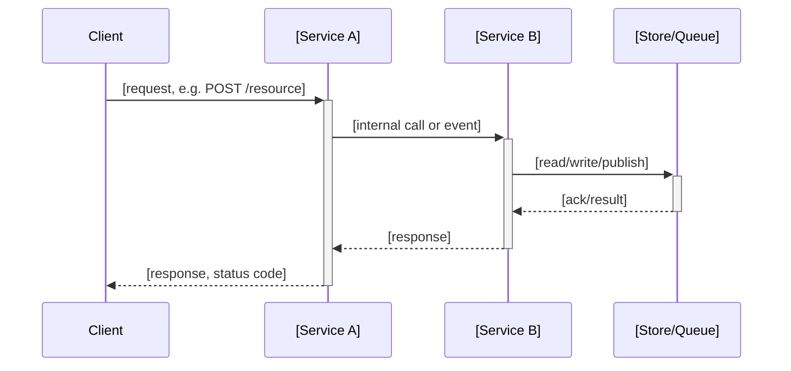

# Architecture Section Template

Copy this structure into `design.md` under `## Architecture` whenever the change adds/modifies
more than one service, endpoint, queue, or store, or changes how existing ones talk to each other.

Covers service/endpoint/schema/queue/store relationships only — no method signatures, call
stacks, or file-level detail. That belongs in `## Program Design` (see `docs/program-design/TEMPLATE.md`).

---

## Sequence Diagram

Required for any change involving more than one service or consumer.



## Endpoint Contracts

One table per new or changed endpoint.

| Field | Value |
|---|---|
| Method | `[GET / POST / PUT / PATCH / DELETE]` |
| Path | `[/api/v1/resource/:id]` |
| Request body | `[JSON shape, or "none"]` |
| Response body | `[JSON shape]` |
| Status codes | `[200, 201, 204, ...]` |
| Error cases | `[400 — validation, 404 — not found, 409 — conflict, ...]` |

## Data Model Diff

Show every new or changed model as a diff — never prose.

```diff
 model [ModelName] {
+  [new_field]: [type]        # [why this field exists]
-  [removed_field]: [type]    # [why it's removed]
   [changed_field]: [old_type] -> [new_type]  # [why the type changed]
 }
```

## Service/Store Relationships

- `[Service A]` → `[Service B]`: [sync call / async event / shared store], [why]
- `[Service A]` → `[Store/Queue]`: [owns / reads / publishes to], [why]
